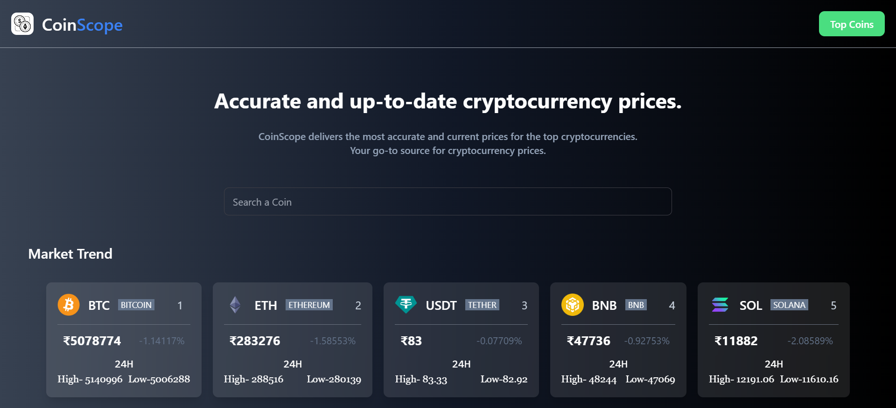

---

# CoinScope

CoinScope is a React application that provides accurate and up-to-date cryptocurrency prices. The app fetches data from the CoinGecko API and displays it in a user-friendly interface. It features a landing page with a search function and a top 100 coins page.

## Features

- **Landing Page**: Displays a search bar and a list of top 5 cryptocurrencies.
- **Top 100 Page**: Displays a table of the top 100 cryptocurrencies with detailed information.
- **Responsive Design**: Styled using Tailwind CSS for a modern and responsive design.

## Technologies Used

- **React**: JavaScript library for building user interfaces.
- **Axios**: Promise-based HTTP client for making API requests.
- **Tailwind CSS**: Utility-first CSS framework for styling.
- **CoinGecko API**: Source of cryptocurrency data.

## Installation

1. Clone the repository:
   ```bash
   git clone https://github.com/omk1r/coinscope.git
   cd coinscope
   ```

2. Install dependencies:
   ```bash
   npm install
   ```

3. Start the development server:
   ```bash
   npm run dev
   ```

The app will be available at `http://localhost:3000`.

## Project Structure

```
coinscope/
├── public/
│   ├── coinscope-logo.png
│   └── index.html
├── src/
│   ├── components/
│   │   ├── Card.js
│   │   └── Header.js
│   ├── Pages/
│   │   ├── Landing.js
│   │   └── Top100.js
│   ├── App.css
│   ├── App.js
│   ├── index.css
│   └── index.js
├── .gitignore
├── package.json
└── README.md
```

## Components

### App

The main component that handles the state and renders either the `Landing` or `Top100` page based on the state.

### Header

A functional component that displays the logo and a button to toggle between the landing page and the top 100 page.

### Landing

Displays a search bar and a list of the top 5 cryptocurrencies. It filters the list based on user input.

### Top100

Displays a table of the top 100 cryptocurrencies with detailed information including price, market cap, total volume, circulating supply, and total supply.

### Card

A card component that displays individual cryptocurrency information on the landing page.

## API

The app fetches data from the CoinGecko API:

```bash
https://api.coingecko.com/api/v3/coins/markets?vs_currency=inr&per_page=100&precision=0&x_cg_demo_api_key={your_api_key}
```

## Usage

- **Search a Coin**: Use the search bar on the landing page to find a specific cryptocurrency.
- **View Top 100 Coins**: Click the "Top Coins" button to view the top 100 cryptocurrencies by market cap.

## Screenshots

### Landing Page



## Contributing

Contributions are welcome! Please open an issue or submit a pull request.

## License

This project is licensed under the MIT License. See the [LICENSE](LICENSE) file for details.

## Acknowledgements

- [CoinGecko API](https://www.coingecko.com/en/api) for providing cryptocurrency data.
- [Tailwind CSS](https://tailwindcss.com/) for the styling framework.
- [React](https://reactjs.org/) for the UI library.

---
